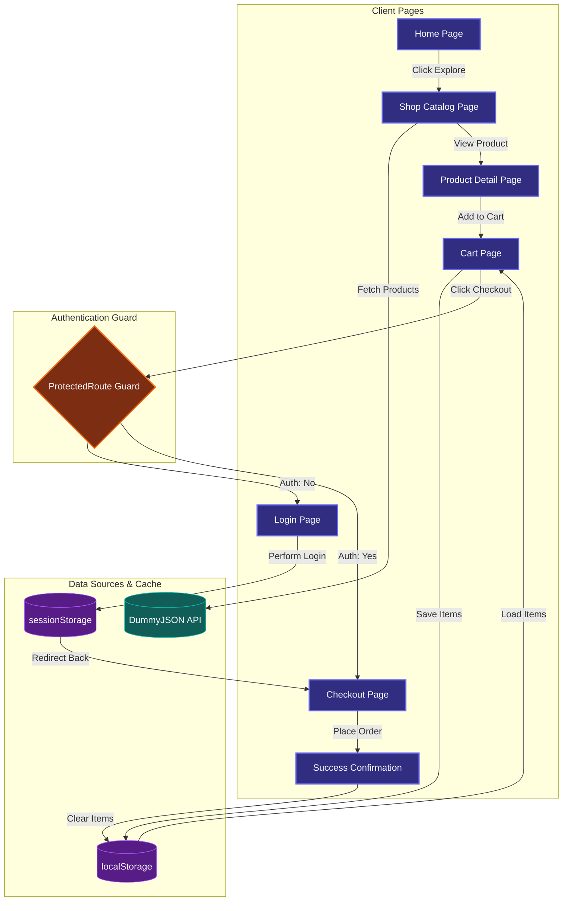

# ShopZone — React E-Commerce Storefront

ShopZone is a clean, modern, and highly interactive Single Page Application (SPA) e-commerce storefront. Built on React, Vite, and React Router, the application features full catalog browsing, single product details rendering, a persistent cart module, and a secure checkout process protected by authentication guards.

---

## 🔗 Project Links
* **Live Demo:** [https://shopzone.vercel.app](https://shopzone.vercel.app)
* **GitHub Repository:** [https://github.com/username/shopzone](https://github.com/username/shopzone)

---

## 📈 Application Flow Diagram

The flowchart below displays how the pages, route guards, external APIs, and browser storage mechanisms interact within ShopZone:



---

## 💡 Key Architectural Details

### 1. Global State Management (React Context)
Instead of passing props down manually (prop drilling), ShopZone manages global state using React Context Providers wrapped around the application router in `main.jsx`:
* **`CartContext`:** Integrates `useReducer` for clean state updates. Actions like `ADD_ITEM`, `REMOVE_ITEM`, `UPDATE_QUANTITY`, and `CLEAR_CART` are dispatched cleanly. The state is synced automatically to `localStorage` inside a `useEffect` hook, keeping the cart intact even after browser reloads.
* **`AuthContext`:** Keeps track of guest login credentials. The authentication state caches to `sessionStorage` so that the user stays logged in during page refreshes but is securely logged out when the browser tab is closed.

### 2. Guarded Checkout Flow
The checkout screen is wrapped with a custom `ProtectedRoute` wrapper component:
* If the user attempts to view `/checkout` while unauthenticated, the route guard intercepts the event, captures the user's intented destination URL in the routing location state, and redirects them to `/login`.
* Once the user logs in as a guest, they are automatically redirected straight back to `/checkout` to finish placing their order.

---

## ✨ Core Features

* **Dynamic API Catalog:** Connects directly with the remote [DummyJSON API](https://dummyjson.com) to load live product information. The catalog includes clean loading state loaders and fallback screens to handle fetch request failures.
* **Responsive Layout & Theme Support:** The application listens to system parameters using `@media (prefers-color-scheme: dark)` styling variables, transitioning smoothly from light colors to dark hues based on browser preferences.
* **Cart Calculations:** Dynamically computes items totals and subtotal amounts on the fly as quantities are incremented or decremented.
* **Checkout & Validation:** Complete shipping and billing validation rules ensuring form fields are entered correctly before final order processing. Placing an order dispatches a clear cart request to empty the active checkout basket.

---

## 🛠️ Tech Stack

* **UI Framework:** React 19 (Functional Components, Hooks, Context, useReducer)
* **Build System:** Vite 8 (Fast Hot Module Replacement server & optimized rollup compilation)
* **Routing Engine:** React Router DOM 7 (Dynamic client routing tables)
* **Animations:** Framer Motion 12 (Micro-interactions, button hover transitions, layout animations)
* **Vector Icons:** Lucide React 1
* **Styling System:** Custom CSS variables and HSL palettes (Fluid grid structures)

---

## 📂 Project Structure

Below is the directory structure showing all configured files and code compartments:

```
shopzone/
├── public/                     # Static public assets
│   ├── favicon.svg             # Page tab logo
│   └── icons.svg               # Integrated icon shapes
├── src/                        # Core application code
│   ├── assets/                 # Media elements
│   │   ├── hero.png            # Main home banner image
│   │   ├── react.svg           # Library branding
│   │   └── vite.svg            # Bundler branding
│   ├── components/             # Reusable UI component blocks
│   │   ├── Navbar.jsx          # Global navigation bar containing dynamic cart totals
│   │   ├── ProductCard.jsx     # Card component listing singular product information
│   │   └── ProtectedRoute.jsx  # Route wrapper gating checkout permissions
│   ├── context/                # Global React context state modules
│   │   ├── AuthContext.jsx     # Controls visitor login & sessionStorage binds
│   │   └── CartContext.jsx     # Handles items lists and localStorage hooks
│   ├── pages/                  # Route views
│   │   ├── Home.jsx            # Core front splash screen
│   │   ├── Shop.jsx            # Main products list fetches and loading frames
│   │   ├── ProductDetail.jsx   # Product metrics sheet with buy options
│   │   ├── Cart.jsx            # Quantity controls and cart list reviews
│   │   ├── Checkout.jsx        # Shipping fields and payment inputs
│   │   ├── Login.jsx           # Guest profile auth page
│   │   └── Contact.jsx         # Support submission forms with feedback loops
│   ├── App.jsx                 # Routing configuration
│   ├── index.css               # Theme styling variables and global layouts
│   └── main.jsx                # App loader mounting Context wrappers
├── .gitignore                  # File exceptions
├── eslint.config.js            # Code standard guidelines
├── index.html                  # HTML framework shell
├── package.json                # Project configurations & launch commands
├── vercel.json                 # Single Page Application routing rules
└── vite.config.js              # Bundle building configurations
```

---

## ⚙️ Installation & Development

To setup and run this project locally, follow these steps:

### 1. Clone the Repo
```bash
git clone https://github.com/username/shopzone.git
cd shopzone
```

### 2. Install Dependencies
Ensure you have Node.js installed (v18+ recommended):
```bash
npm install
```

### 3. Run Development Server
```bash
npm run dev
```
Open [http://localhost:5173](http://localhost:5173) in your browser.

### 4. Build for Production
```bash
npm run build
npm run preview
```

---

## 🚀 Vercel Deployment

For routing to function correctly on page refreshes when deploying to Vercel, the project utilizes a `vercel.json` file to map all sub-routes back to the SPA root index page:

```json
{
  "rewrites": [
    { "source": "/(.*)", "destination": "/" }
  ]
}
```

---

## 📄 License
This project is licensed under the MIT License.
